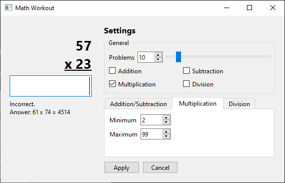

## Math Workout

**Math Workout** is a desktop application for practicing basic arithmetic through interactive problem-solving. It is written in **C++** using the **Qt6** framework.

The program generates math problems based on user-selected operations, including addition, subtraction, multiplication, and division. Users can choose how many problems to work through in a session and control the range of numbers used, allowing for adjustable difficulty.

Each problem is displayed one at a time, with an input field for submitting answers. After each response, the program immediately indicates whether the answer is correct or incorrect. If incorrect, the correct answer is shown to help reinforce learning.

The application includes a settings interface where users can configure problem count, select operations, and define minimum and maximum values for generated numbers. Changes can be applied or discarded before starting or continuing a session.

## Screenshots (Current Version)

